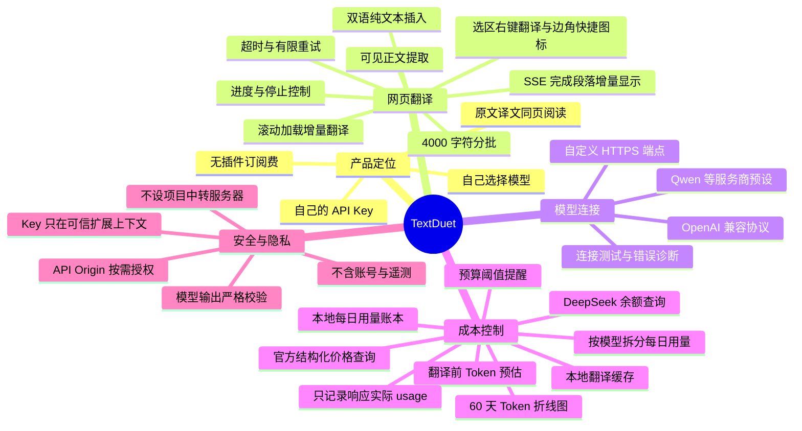
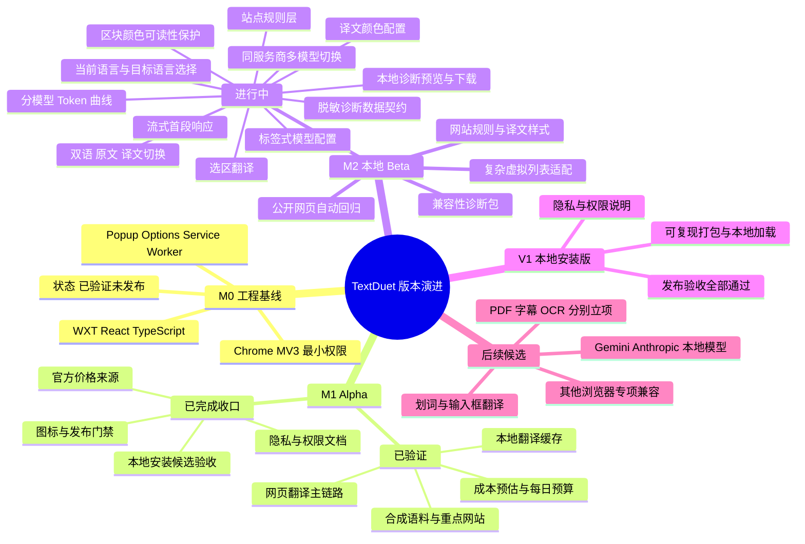

# TextDuet

> Your key. Two languages. One page.

TextDuet 是一款本地优先、开源、无插件订阅费的 Chrome 双语网页翻译扩展。用户提供自己的模型 API Key、API Base URL 与模型名称；网页文本从浏览器直接发送给用户选择的模型服务商，不经过 TextDuet 中转服务器。

当前版本：`0.1.0 本地安装版` · 平台：`Chrome Manifest V3` · 许可证：[Apache-2.0](./LICENSE)

> TextDuet 不收取插件订阅费，但模型服务商可能收取 API 调用费用。`0.1.0` 仅以本地安装版形式分发（Chrome 开发者模式加载 `textduet-0.1.0-chrome.zip`），不提供 Chrome Web Store、其他商店或自动更新。

## 产品全景



## 版本功能图



GitHub Markdown 原生支持 Mermaid 图表；上述 `mindmap` 使用层级缩进表达 XMind 风格的产品结构。若当前 Markdown 阅读器不支持渲染，代码块本身仍是一份可读的层级大纲。

## 当前可用能力

- OpenAI Chat Completions 兼容接口，以及阿里云百炼 Qwen、OpenAI、DeepSeek、OpenRouter、硅基流动预设。
- 自定义 HTTPS API Base URL、API Key、同一服务商的多个模型名称/code 和目标语言；Options 用回车或逗号生成模型标签，标签和 Popup 均可切换当前模型。
- 选中文本后可点击选区边角的 TextDuet 图标快速翻译，也可在 Popup/Options 关闭该快捷图标；右键菜单入口始终保留。
- API 域名运行时授权；API Key 支持会话级或用户主动选择的本机持久化。
- 当前网页已加载正文逐段翻译，并在本次运行中自动处理滚动加载的新内容；支持双语/仅原文/仅译文切换、可配置译文颜色、单一状态按钮、嵌套去重、进度、停止、超时和有限重试。偏好色与区块背景相近时，本地对比度门禁会优先回退原文色；模型只能在受限候选中提供建议。
- 当前网页同一轮译文保留在页面会话中；再次点击“翻译当前网页”会移除旧译文、绕过本地缓存并重新请求当前模型，可能产生新的模型费用。单纯切换显示方式不调用模型。
- M2 已为 GitHub、框架技术文档、海外社区、创意设计站和 Chroma Research 加入保守的本地提取规则；Chroma 正文目录链接可进入翻译候选，页面壳层的可读导航文本也会纳入，未知站点自动回退通用提取。
- 翻译前 Token/成本区间预估，以及只记录 Provider 响应实际 usage 的 IndexedDB 每日用量账本。
- Options 按模型展示并滚动保留最近 60 天输入/输出 token 每日曲线和汇总；Popup 只展示今日实际 token。
- 50%、80%、100% 本地每日预算提醒。
- OpenRouter 当前模型价格可从官方 `/api/v1/models` 结构化接口查询；其他 Provider 查不到可靠结构化价格时不展示数字价格。
- 使用 DeepSeek 官方 API 配置时，可由用户主动查询当前充值与赠送余额；余额不换算为 token，也不写入账本。
- 30 天、50 MiB、LRU 淘汰的本地译文缓存，以及占用摘要和清理入口。
- 当前默认 P0 矩阵包含 16 个已验证可访问 URL，优先覆盖海外社区、框架文档与创意设计内容；动态节点复用、Service Worker 回收和恶意模型文本纯文本渲染已有 Chrome 安装态回归。
- Options 可为最近一次翻译页面生成本地脱敏诊断预览；用户可选择问题类型，并明确同意后才包含已去除查询参数和片段的页面路径。诊断包只下载到本机，不自动上传。
- Popup 与 Options 当前采用暖纸色、白色表面、赤陶色主操作和赭石色辅助的统一主题；该视觉升级仍属于 M2 开发内容，不代表首版已正式发布。

完整状态以[产品迭代路线图](./docs/PRODUCT-ROADMAP.md)和[产品迭代记录](./docs/ITERATION-LOG.md)为准，不把计划中的能力描述为已经发布。

项目验收边界：Agent 负责源码、自动化、构建安全门和验收材料；项目所有者负责每个版本的 Chrome 打包、加载和最终人工验收。

## 本地试用

要求：Node.js 22 或更高版本、当前稳定版 Chrome。

```bash
npm ci
npm run typecheck
npm test
npm run build
npm run release:check
```

公开网站结构矩阵使用 Mock Provider，不读取 `.env.local` 或产生模型费用；需提供本机 Playwright 和 Chrome 可执行路径，具体清单与命令见[网站兼容与验收计划](./docs/SITE-COMPATIBILITY.md)。

`npm run release:check` 会同时生成 `.output/textduet-0.1.0-chrome.zip`。ZIP 用于传输，必须先解压；本机直接试用可使用已经构建好的 `.output/chrome-mv3`。

然后打开 `chrome://extensions`：

1. 开启“开发者模式”。
2. 点击“加载已解压的扩展程序”。
3. 选择 `.output/chrome-mv3`。
4. 打开 TextDuet 设置页，填写模型端点、模型名称与 API Key。
5. 推荐先选择“仅当前会话保存”，再执行连接测试。
6. 打开普通 HTTP/HTTPS 文章页，从 Popup 启动翻译。

首版仅支持上述本地加载方式，不提供 Chrome Web Store、其他商店或自动更新。

试用真实模型可能产生费用。建议先使用短公开页面和低成本模型；Chrome 内部页面、登录墙、付费墙与验证码页面不在支持范围。

开发模式：

```bash
npm run dev
```

## 本地 Provider 验收变量

仓库只跟踪 `.env.example`，真实测试值放在被 Git 忽略的 `.env.local`：

```dotenv
TEXTDUET_TEST_API_BASE_URL=https://api.example.com/v1
TEXTDUET_TEST_API_KEY=
TEXTDUET_TEST_MODEL=
```

这些变量仅供用户主动执行的本地 Provider 验收使用，不得以 `VITE_`、`WXT_PUBLIC_` 等公开前缀暴露给扩展构建。标准单元测试使用 Mock Provider，不读取真实 Key，也不产生模型费用。

## 安全与隐私

- API Key 不发送给 Translator Script、网页 DOM、用量账本、日志或测试夹具。
- 网页文本只在用户触发翻译后发送给其选择的模型服务商。
- 浏览器扩展本地存储不是操作系统级加密保险箱；持久保存前应理解风险。
- MVP 不包含账号、云同步、遥测、广告 SDK 或自动问题上传。
- 模型返回内容是不可信输入，经过结构校验后仅以纯文本渲染。

## 项目文档

- [产品需求文档](./docs/PRD.zh-CN.md)
- [产品迭代路线图](./docs/PRODUCT-ROADMAP.md)
- [产品迭代记录](./docs/ITERATION-LOG.md)
- [CHANGELOG](./CHANGELOG.md)
- [技术架构](./docs/ARCHITECTURE.md)
- [网站兼容与验收计划](./docs/SITE-COMPATIBILITY.md)
- [开发者安装与本地试用](./docs/DEVELOPMENT.md)
- [隐私政策草案](./docs/PRIVACY.md)
- [Chrome 权限说明](./docs/CHROME-PERMISSIONS.md)
- [Alpha 本地安装候选验收清单](./docs/RELEASE-CHECKLIST.md)
- [开源许可证说明](./docs/LICENSING.md)
- [贡献指南](./CONTRIBUTING.md)
- [Agent 开发规范](./AGENT_DEV.md)

## 许可证

[Apache-2.0](./LICENSE)。第三方依赖归属见 [Third-Party Notices](./THIRD_PARTY_NOTICES.md)。
