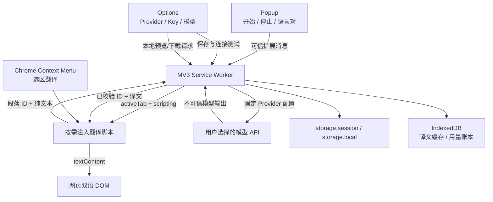

# TextDuet 技术架构

## 1. 技术选型

- WXT：扩展构建与 Manifest 生成。
- React：Popup 与 Options 页面。
- TypeScript strict：跨上下文消息和 Provider 契约。
- Vitest：核心逻辑单元测试。
- Zod Mini：运行时消息、配置和模型响应的边界校验，减少各扩展入口的重复打包体积。
- Radix UI：Popup/Options 中按需使用的无样式交互原语。
- Lucide React：按图标导入的界面图标。
- Apache ECharts：Options 的 token 用量折线图；只注册 Line、Grid、Tooltip、Legend 与 CanvasRenderer，不引入 React 包装层或完整图表入口。
- Chrome Manifest V3：首发运行模型。
- UI 主题：Popup 与 Options 共享暖纸色、白色表面、赤陶色主操作和赭石色辅助 token；主题只存在于扩展 UI 和网页状态提示样式，不进入 Provider 数据流。

选择 WXT 是为了让后台、Popup、Options 与注入脚本保持独立入口。首版只构建、测试和发布 Chrome Manifest V3；项目不使用运行时远程代码。

项目明确不使用 Next.js。TextDuet 不需要 SSR、Server Components、App Router 或服务端部署；Popup、Options、Service Worker 与 Translator Script 均由 WXT 构建。任何组件库必须支持普通 React/Vite 用法，不能要求 Next.js 运行时。

## 2. 组件边界



### Popup

- 获取脱敏后的 Provider 状态。
- 选择源语言与目标语言。
- 触发当前标签页翻译或停止。
- 不读取 API Key。

### Options

- 编辑 Provider 配置。
- 通过阿里云百炼 Qwen 等显式预设填写兼容端点；预设只改善配置体验，不改变协议标识。
- 在用户点击时申请 API Origin 权限。
- 将 Key 交给 Service Worker 保存。
- 不显示已保存 Key 的原文。

### Service Worker

- 唯一允许读取 API Key 的业务层。
- 根据可信设置拼接 Provider 请求 URL。
- 执行模型调用、SSE/JSON 响应验证和错误映射。
- 维护按标签页取消的流式 Port。
- 按需将 `translator.js` 注入当前活动标签页。
- 不接受内容脚本传入任意网络 URL。

### Translator Script

- 仅在用户点击后注入。
- 通过 `src/translator/site-rules.ts` 按当前主机选择保守内容根节点；未知站点或规则根缺失时回退通用提取。
- 提取可见块级文本并分批。
- 在本次运行中使用受控 MutationObserver 监听文档根节点的新增、变为可见和文本变化，去抖后串行增量处理；复用节点重新插入时失效旧源文本快照。
- 只发送段落 ID、文本、语言对和已校验译文。
- 通过 Port 接收完成段落并立即渲染；动态新增内容在当前批次结束后进入下一批。
- 将已校验译文通过 `textContent` 插入 DOM。
- 不读取 Storage，不接触 API Key。

## 3. 目录结构

```text
entrypoints/
  background.ts          MV3 Service Worker
  translator.ts          activeTab 按需注入脚本
  popup/                  工具栏弹窗
  options/                配置页面
src/
  background/             可信后台业务编排
  core/                   跨上下文契约与默认配置
  providers/              模型厂商适配层
  storage/                配置和密钥生命周期
tests/                    单元测试
docs/                     PRD 与架构决策
```

`docs/PRODUCT-ROADMAP.md` 维护阶段计划与状态，`docs/ITERATION-LOG.md` 维护实际交付与验证证据；根目录 `CHANGELOG.md` 只记录面向用户的发布变化。三者不得替代运行时 schema、PRD 或架构契约。

## 4. 消息协议

所有消息由 `RuntimeMessage` 判别联合定义。当前分为三类：

1. 设置：`GET_PROVIDER_SETTINGS`、`SAVE_PROVIDER_SETTINGS`、`TEST_PROVIDER`。
2. 成本：`GET_COST_DASHBOARD`、`GET_USAGE_HISTORY`、`GET_PROVIDER_BALANCE`、`REFRESH_PROVIDER_PRICING`、`SAVE_COST_SETTINGS`、`CLEAR_USAGE_LEDGER`、`ESTIMATE_TRANSLATION`。
3. 缓存：`GET_TRANSLATION_CACHE_DASHBOARD`、`CLEAR_TRANSLATION_CACHE`。
4. 标签控制：`TRANSLATE_ACTIVE_TAB`、`STOP_ACTIVE_TAB`、`GET_ACTIVE_TAB_TRANSLATION_STATE`、`SET_ACTIVE_TAB_DISPLAY_MODE`、`SET_ACTIVE_MODEL`、`SET_LANGUAGE_PREFERENCES`。
5. 页面翻译：`START_PAGE_TRANSLATION`、`STOP_PAGE_TRANSLATION`、`SET_PAGE_DISPLAY_MODE`、`GET_TRANSLATION_STATE`、`TRANSLATE_BATCH`、`TRANSLATE_BATCH_STREAM`、`TRANSLATE_SELECTION`。

流式 Port 名为 `textduet-translation-stream`，事件只允许 `TRANSLATION_BLOCK`、`TRANSLATION_COMPLETE` 和 `TRANSLATION_ERROR`；事件先经过 schema 校验，再进入网页渲染。

所有未知消息先通过 `src/core/schemas.ts` 的 Zod 判别联合解析，再进入业务处理。TypeScript 类型由同一 schema 推导；公开设置、操作结果和翻译批次也在接收上下文再次校验。Schema 使用严格对象，拒绝内容脚本夹带任意 URL、认证字段或未声明参数。

## 5. Provider 适配

统一接口：

```ts
interface TranslationProvider {
  translate(settings, apiKey, request): Promise<TranslationBatchResponse>;
  translateStream(settings, apiKey, request, options): Promise<ProviderTranslationStreamResult>;
  testConnection(settings, apiKey): Promise<void>;
}
```

MVP 的 `OpenAiCompatibleProvider` 使用 Chat Completions：

- 请求 URL：`{baseUrl}/chat/completions`。
- 认证：`Authorization: Bearer {apiKey}`。
- 输入：system prompt + JSON 序列化的段落数组。
- 输出：严格校验 `{ blocks: [{ id, translatedText }] }`。
- 可靠性：默认单请求超时 60 秒，支持 Abort 信号，并只对明确的限流、服务端和网络错误执行有限重试。
- 流式：优先解析 `text/event-stream` 的 Chat Completions SSE；普通 JSON 响应在同一次请求中回退到完整解析，不自动重复请求。
- 阿里云 Qwen3 翻译兼容：仅当 Base URL 属于阿里云域名且模型名符合 Qwen3 家族时，在 Chat Completions 请求顶层加入 `enable_thinking: false`；该字段用于已验证的翻译延迟兼容，不扩散到其他 OpenAI-compatible Provider，也不进入通用设置、内容脚本或网页。
- Options 提供“阿里云百炼 Qwen”显式预设并填入兼容模式 Base URL。`provider` 仍保存为协议标识 `openai-compatible`，避免把 UI 厂商品牌误建模为第二套网络协议。

当厂商的认证、协议或内容结构不同，应新增 Provider 类，不在现有适配器里堆叠大量条件分支。

## 6. 权限模型

必需权限：

- `activeTab`：用户点击后临时访问当前标签页。
- `scripting`：注入 `translator.js`。
- `storage`：保存配置以及会话级或本机级 Key。
- `contextMenus`：用户右键选中文本后显示选区翻译入口。

可选主机权限：

- `https://*/*` 仅作为可申请范围。
- 实际运行时只请求用户所填 API Base URL 对应的 Origin。
- 网站级自动翻译若加入，必须另外请求该网站 Origin。

不在 Manifest 中静态注册 `<all_urls>` 内容脚本，避免扩展安装后常驻所有网页。

## 7. 存储模型

| 数据 | 区域 | 内容脚本可访问 | 备注 |
| --- | --- | --- | --- |
| Provider 非敏感配置 | `storage.local` | 否 | Base URL、当前模型、模型列表、语言、显示模式和译文颜色等 |
| 会话级 API Key | `storage.session` | 否 | 默认，浏览器关闭后清除 |
| 持久 API Key | `storage.local` | 否 | 用户主动选择，未加密 |
| 翻译缓存 | IndexedDB（M1） | 否 | 上下文摘要、译文、时间和大小；不含 Key、源文本或 URL |
| 模型价格与每日预算 | `storage.local` | 否 | 不包含密钥或网页文本 |
| 每日 token/成本账本 | IndexedDB（M1） | 否 | 按本地日期、Provider、模型聚合；账单界面只公开 token |
| 最近翻译标签页 ID | storage.session | 否 | 仅用于 Options 诊断定位；标签页关闭时清理，不保存 URL 或正文 |

Service Worker 启动后调用 `setAccessLevel(TRUSTED_CONTEXTS)`。这减少内容脚本读取风险，但不能把本地持久存储变成操作系统级加密保险箱。

## 8. 翻译数据流

1. Translator Script 解析当前页面主机，选择本地站点规则的内容根节点和局部块选择器；未知站点或根节点缺失时查询通用块级元素集合。页头、导航 tab/link 和页脚可读文本纳入候选，交互控件、侧栏、代码和表单继续排除。Chroma Research 只在正文根内把目录链接加入候选。
2. 过滤隐藏、可编辑、代码、表单与交互区域；重复运行时复用内容脚本内缓存的原文。
3. 正规化空白，以内容脚本内的 WeakMap 为节点分配不可被网页伪造的 ID，并去除嵌套重复候选。
4. 通过 `src/core/translation-planning.ts` 的纯函数按 4000 字符预算创建批次。
5. Service Worker 根据文本、语言、Provider、模型和提示词生成 SHA-256 缓存键，并在可信 IndexedDB 查询译文。用户重新点击“翻译当前网页”时显式绕过缓存；动态增量和其他非强制请求仍可使用缓存。
6. 全命中直接返回缓存，不读取 Key、不调用 Provider、不新增用量记录；部分命中只构造未命中子请求。
7. Service Worker 从可信存储读取 Provider 配置和 Key。
8. Provider 将页面文本视为不可信数据，请求模型只执行翻译；单次请求 60 秒超时，429、5xx 和网络错误最多进行三次指数退避尝试。
9. Service Worker 校验 JSON、段落数、ID 和字段类型，写入缓存后按原请求顺序合并命中与新译文。
10. Translator Script 通过 ID 定位节点，以纯文本插入译文，并用原文 wrapper 支持双语、仅原文和仅译文三种 CSS 显示方式。每个候选块附带标准化原文色、有效背景色、偏好色和本地对比度；模型只能返回 `preferred` / `source` 建议，本地 WCAG 门禁最终决定实际颜色并通过已校验的内联属性应用。网页不创建全局状态浮层，状态只保留在扩展上下文。
11. 用户主动启动后，Translator Script 在当前运行会话内监听文档根节点的新增、可见性和文本变化；去抖后只收集尚无当前语言译文的块，复用同一串行批次与缓存链路。节点被移出后离线改写再插回、或整个 `body` 被替换时，旧 WeakMap 源文本快照会失效。
12. 用户停止时，Translator Script 断开 Observer、清理待处理扫描并阻止后续批次，Service Worker 同时按标签页取消当前在途请求。
13. 翻译启动成功后，Service Worker 仅在 storage.session 记录最近翻译标签页 ID。Options 诊断请求读取该 ID，向 Translator Script 请求脱敏计数，再在本地生成诊断对象；路径必须由用户单独同意，下载使用浏览器本地 Blob，不自动上传。
14. Popup 在翻译进行中轮询当前页的脱敏状态以同步单一操作按钮；该查询不读取网页正文、Key 或 Provider 响应。模型切换和语言对只更新可信设置，用户再次触发翻译后才产生新请求。
15. 用户从 Chrome Context Menu 或选区边角快捷图标触发选区翻译时，Service Worker 按 `frameId` 注入 Translator Script；Translator Script 重新核对当前选区和正文锚点，跨段选区作为一个缓存块在锚点后插入纯文本译文。快捷图标只在用户打开 Popup/开启设置后按需注入当前页，不注册静态全站脚本。
16. Popup 与 Options 的语言选择共享 `src/ui/LanguagePairPicker.tsx`，页面样式必须通过组件级 class 和显式网格维护，避免宽泛后代选择器造成跨组件污染。

## 9. 安全清单

- [x] API Key 不发送给 Translator Script。
- [x] Provider URL 不由 Translator Script 指定。
- [x] API Base URL 强制 HTTPS。
- [x] 模型输出使用 `textContent`。
- [x] 翻译批次校验 ID 与数量。
- [x] API Origin 运行时申请。
- [x] 不使用远程代码。
- [x] 运行时消息、公开设置、操作结果与模型响应 schema 校验。
- [x] HTTP 401/403、402、404、429、5xx 与网络错误的产品文案映射。
- [x] 单请求超时、按标签页取消与有限指数退避。
- [x] 翻译缓存容量、过期、LRU 淘汰与清理策略。
- [x] 动态新增正文增量去重，停止时清理 Observer 与待处理扫描。
- [x] Alpha 本地安装候选完成威胁边界与隐私文档复核。
- [ ] 商店隐私审查仅在未来独立立项商店分发时执行。

## 9.1 M1 成本核算

M1 增加独立的 `CostEstimator` 与 `UsageLedger`，不得把成本计算散落在 Provider 或界面中。

成本流程：

1. `CostEstimator` 根据请求文本和提示词估算输入 token，并用译文倍率生成输出 token 区间。
2. Provider 请求结束后，将响应中的实际 `usage` 标准化为统一结构；缺失时只向本次结果保留估算标记，不写入 token 账本。
3. `UsageLedger` 仅按本地日期、Provider、模型累计 Provider 返回的实际输入 token、输出 token 和对应本地预算金额。
4. `BudgetPolicy` 计算 50%、80%、100% 阈值，保证同一日期每个阈值只通知一次。
5. 可选硬停止只阻止新任务，不中断已经付费并在途的请求。

当前实现细节：

- `src/core/cost.ts` 负责 token 区间、金额计算、实际/估算结算和预算阈值，公式具有确定性单元测试。
- 当前模型的手动价格配置保存在 `storage.local`；价格未启用或模型名不匹配时只展示 token，不把金额 0 表述为免费。
- `src/core/pricing-sources.ts` 按精确 HTTPS API 主机名识别官方来源；`src/providers/official-pricing.ts` 只访问已确认的官方结构化价格 API，并由 Service Worker 统一调用。
- 聚合账本使用 `textduet-usage` IndexedDB v1，按本地日期、币种、Provider 和模型保存，不含 Key、网页正文或 URL。
- `GET_USAGE_HISTORY` 在可信上下文按最近 60 个本地日期返回全局聚合与按 Provider/模型分组的每日 token 序列，两者都补齐空日期；读取历史与成功记账前会删除更早记录和旧 Alpha 留下的含估算聚合记录，不升级 IndexedDB 结构。
- Options 的 ECharts 图表只使用按需模块，用户先选择模型再查看该模型的每日输入/输出曲线；输入使用实线、输出使用虚线，Y 轴以当前序列最大量级选择 token/K/M/B，模型汇总同时提供文字值。Popup 和账单卡不展示本地计算金额。
- Provider 返回 `prompt_tokens`/`completion_tokens` 时记为实际 usage；缺失时仍返回本次预估，但 `isLedgerRecorded` 为 false 且不改变历史曲线。
- `GET_PROVIDER_BALANCE` 只从可信设置读取已保存 Key，仅当 Base URL Origin 精确为 `https://api.deepseek.com` 时访问官方 `/user/balance`；响应经 schema 校验后脱敏返回 Options，不持久化。
- IndexedDB 失败不会丢弃已经付费返回的译文；界面会提示该批次未成功记入本地账本。
- 50%、80%、100% 提醒状态与日期、币种一起持久化；100% 仍只提醒，不执行硬停止。
- 当前只实现提醒；可选硬停止以及“本次继续/今日继续”覆盖尚未实现。

价格条目必须包含 `currency`、`inputPerMillion`、`outputPerMillion`、`updatedAt` 与 `source`。当前版本只保存用户手填的预算提醒基准；官方查询结果只展示、不写回配置。产品始终提醒最终费用以模型厂商账单为准。

### 9.1.1 官方用量与价格 API 适配矩阵

| Provider | 普通推理 Key 的每日 token 历史 | 结构化模型价格 | 当前处理 |
| --- | --- | --- | --- |
| OpenAI | Organization Usage API 需要 Admin API Key | 未确认稳定的结构化价格 API | 不申请管理员 Key；使用本地账本，不展示官方数字价格 |
| 阿里云百炼 Qwen | 推理响应提供 usage；账单 OpenAPI 需要独立阿里云访问凭证 | 官方模型文档，不是稳定结构化价格 API | 使用响应 usage 与本地账本，不展示官方数字价格 |
| DeepSeek | `/user/balance` 只返回余额，不提供每日 token 历史 | 官方价格文档，不是结构化价格 API | 用户主动查询并展示余额；不持久化、不换算 token、不展示官方数字价格 |
| OpenRouter | `/api/v1/activity` 需要 Management Key | `/api/v1/models` 公开返回 `pricing.prompt/completion` | 本地账本展示 token；精确模型匹配后展示 USD/百万 token |
| 硅基流动 | 未确认普通推理 Key 的每日 token 历史 API | `/v1/models` 未确认可靠价格字段 | 使用响应 usage 与本地账本，不展示官方数字价格 |

TextDuet 不新增、保存或传输 Admin/Management/云账号访问凭证。所有远端价格和余额查询都由可信 Service Worker 发起；OpenRouter 价格查询不携带 API Key、模型名称或本地用量，模型匹配在本地完成；DeepSeek 余额查询只在用户点击后向官方端点携带其普通推理 Key，结果不持久化。

## 9.2 M1 本地翻译缓存

- `src/core/translation-cache.ts` 负责确定性缓存键、大小估算、过期/LRU 选择和响应顺序合并。
- `src/storage/translation-cache.ts` 使用独立的 `textduet-translation-cache` IndexedDB v1；缓存条目不持久化源文本、Key、认证头或 URL。
- 缓存键包含固定 schema/prompt 版本、Provider、模型、语言对、实际系统提示词和源文本，再保存为 SHA-256 摘要。
- 默认有效期为 30 天，容量上限为 50 MiB；写入后先删除过期项，再淘汰最久未访问项。
- `src/background/translation-service.ts` 在付费调用前编排缓存；全命中跳过 Key 和 Provider，部分命中只结算未命中部分。
- IndexedDB 查询或写入失败不会阻止翻译；页面会说明缓存暂时不可用，Provider 返回的译文仍正常展示。
- 颜色建议不写入 IndexedDB。缓存命中只恢复译文文本，Translator Script 使用当前页面样式和当前用户偏好执行本地可读性回退；因此无需升级缓存 schema。
- Options 只读取条目数、近似占用、容量和有效期，并在用户确认后清空译文缓存；模型配置和用量账本不受影响。

## 10. 测试策略

### 单元测试

- Provider URL 解析。
- 模型 JSON 解析与错误分支。
- 文本分批预算。
- DOM 候选过滤。
- 设置迁移与密钥存储模式。
- 缓存键失效维度、过期/LRU、全命中跳过 Provider、部分命中合并与失败降级。

### 浏览器集成测试

- Popup → Service Worker → 注入脚本。
- Options 权限申请与连接测试。
- 普通文章翻译、停止、重复翻译。
- 虚拟列表节点复用、正文容器替换和 Service Worker 回收后的恢复。
- 页面返回脚本字符串时不执行。
- Service Worker 被回收后可继续工作。

### Provider 兼容矩阵

- OpenAI。
- DeepSeek。
- OpenRouter。
- 硅基流动。
- 阿里云 Qwen3：真实连接测试与两个 GitHub 英文 README 受控冒烟通过；厂商账单金额一致性尚未验证。
- 自定义 OpenAI 兼容代理。

真实 Key 只在本地手工测试或受保护的 CI Secret 中使用，不进入测试夹具和日志。

## 11. 下一阶段架构任务

1. 将逐批状态持久化到可信上下文，使 Popup 重开后可恢复当前任务摘要。
2. 把公开网页矩阵接入可控的周期回归，并保持环境失败与产品失败分离。
3. 继续完善用户预览后主动下载/提交的兼容性诊断包，并在可启动扩展 Service Worker 的 Chrome 环境补齐成功路径回归。
4. 经独立立项后评估远程维护的数字价格目录；在可验证更新机制就绪前保持手动价格。
